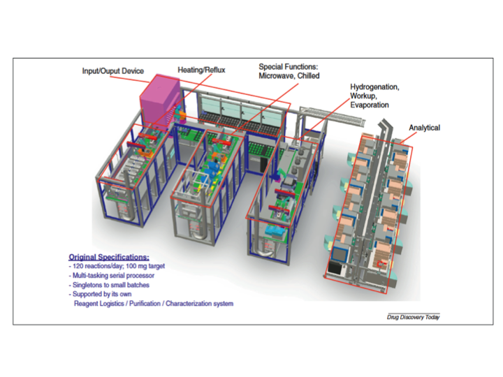
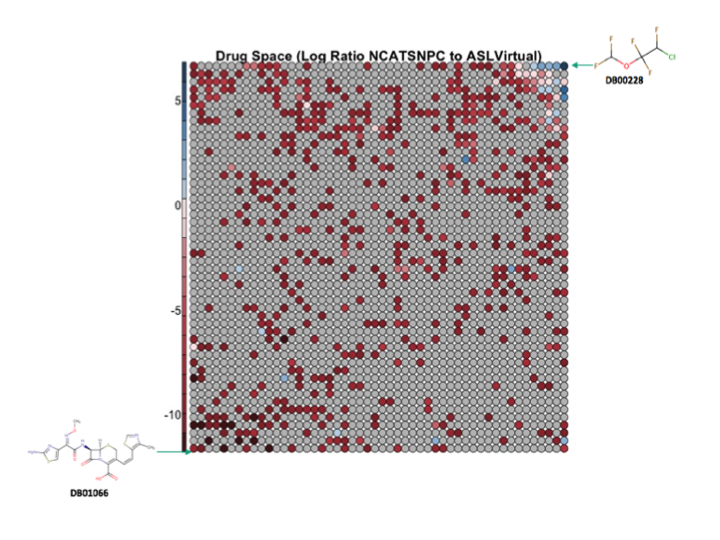

Project Proposal
===============================================================================

Using Big Data Analytics to Guide Synthetic Strategies Employed on an Automated Synthetic Laboratory:Applications to the Pharmaceutical Industry
-------------------------------------------------------------------------------

Preface
-----------------
I chose this class so that I could apply big data techniques leveraging the infrastructure of FutureSystems. This data is new/unpublished, the subject area is a burgeoning domain in the pharmaceutical industry (and thus may have a proprietary component), and we hope to publish a paper which may reference findings from this project.

Background
-----------------
The domain of focus for this hybrid analytical-parallelization project is in the area of cheminformatics. More specifically this project will be examining a new technology in the pharmaceutical industry, namely automated synthetic laboratories (ASL). Automate synthetic laboratories use robots combined with sophisticated scientific equipment (mass specs, etc) to synthesize compounds with minimal human intervention, providing a panoply of new chemical synthesis opportunities/applications. Below is a figure showing the ASL.

One typical process in cheminformatics is to classify/cluster/arrange thousands to millions of compounds in meaningful ways such that medicinal chemists can make value judgments about which compounds to further investigate for drug discovery purposes. One outstanding question related to the ASL is how much of the current drug space is covered/accessible to the ASL. Or said another way-what types of synthesis have yet to be done on the ASL. Discovering new possibilities for chemical synthesis by the ASL is a hot topic and will serve as the motivating factor for the work done in this project.

This project will examine the chemical/drug space currently feasible by an automated synthetic laboratory at a major pharmaceutical company. We will compare known drug space represented by public sources of drug information (ie pubchem/ NCATS  pharmaceutical collection) to the chemical space currently possible by the ASL (provided by Eli Lilly). There are ~2 million compounds projected to synthetically feasible by the ASL. The question addressed here is how many of these compounds represent novel chemistries and are similar to drugs currently known. With this information we can guide synthetic chemists on which new compounds/synthesis to target for further development.

Team
-------------------------------------------------------------------------------

  * Chris Gessner, crgessne, crgessne, crgessne(Lead)
 
Role
^^^^^^^^^^^^^^^^^^^^^^^^^^^^^^^^^^^^^^^^^^^^^^^^^^^^^^^^^^^^^^^^^^^^^^^^^^^^^^^

* Deployment: Member A
* Configuration: Member A
* Database: Member A
* Map/Reduce Functions: Member A
* Algorithm: Member A
* Plot: Member A

Specific Aims
-------------------------------------------------------------------------------

1) Quantitate the differences/similarities between the 2 million ASL virtual compounds to the current known drug space (5000 compounds) leveraging cheminformatics techniques of chemical fingerprinting/clustering using distributed machine learning algorithms of Apache Spark on hadoop distributed file system/cluster.

2) Create a multi dimensionally scaled/dimension-reduced plot(s) of the relationships between the ASL and current drug space. Several different types of plotting will be explored including Kohonen self organizing maps, PCA, and MDS. See http://salsahpc.indiana.edu/plotviz/#screenshots for similar idea.

3) Use more computationally intensive chemical comparison algorithm (substructure similarity) to assess compound similarity between ASL space and drug space. This would replace the less accurate chemical fingerprinting comparison technique and may yield overall more accurate results. If sucesssful the result sof this aim would be used to improve aim’s 1 and 2.

Artifacts/Deliverables
-------------------------------------------------------------------------------

1) CSV file representing a table of (reproducible by ansible script) relevant numbers investigating/reporting various relationships between the current synthetically feasible space of pharmaceutical ASL to the current known drug space.

2) Plots (png’s) of dimension-reduced (ie 2d/3d views) of the relationships between ASL space and drug space illustrating areas of ASL synthetic feasibility. As a motivating factor an example is given below generated with R on a single machine. However R can not scale to the millions of data points (compounds) needed for an accurate clustering/multidimensionally scale view of the data.

Above a kohonen SOM was generated/trained on 10000 points -a mixture of 4000 drug compounds and 2 million ASL compounds. Clearly there is an imbalance between the number of trained compounds (10k) and the number of total compounds (2M). However R on a single machine cannot generate kohonen SOM’s on millions of data points. So instead the ‘mapping’ phase of kohonen SOM was used to map the remaining 2M compounds onto the two dimensions. THis was far from ideal. What we would like is to be able to cluster and dimension reduce over all 2M compounds. The distributed computing environment of futuregrid/hadoop cluster with spark and plotvis/IU multidimensional scaling technology will allow for a more accurate view of the overall chemical drug space landscape.

More on Specific aim 3. We are also taking another approach that is completely infeasible in any computing environment except distributed. We aim to compare 2M chemical compounds by chemical substructure similarity (subgraph isomorphism, NP-complete)(compared to computationally more tractable fingerprint method employed above).
So instead of relying on transformed projection of compound into vector space for means of comparison of two compounds, we will aim to compare the structure of the compounds directly using a technique in cheminformatics of substructure comparison.
In addition to swapping out one chemical comparison method (fingerprinting) to another (direct substructure overlap comparison), using substructure methods we will create a hierarchical clustered  view of the 2M ASL compounds to understand how data aggregates  within itself.

List of Technologies
-------------------------------------------------------------------------------

Lilly supplied 2 million  ‘virtual’ compounds projected to be synthetically feasible by the ASL. Since ultimately we are looking to provide information to chemists to make decisions we need to
apply algorithms to process the  high volume chemical substances in meaningful ways and then 
visualize results of millions of compounds arranged in meaningful ways to communicate results back to chemists to guide decisions.

1) Algorithmic-Analytical
 * Chemical substance interpretation - CDK/knime
 * Murcko Scaffolds Generation- CDK/knime
 * Chemical fingerprinting - CDK/knime
 * Substructure Matching/subgraph isomorphism - CDK
 * Clustering
  * Kohonen SOM - (optional with parallel R)
  * Kmeans - Apache Spark
  * Multidimensional scaling machine learning libraries -Apache Spark with mllib. 
  * PCA analysis - Apache Spark

2) Infrastructure-Parallelization 
 * DFS-Hadoop Cluster
 * Cluster manager -yarn
 * Deploy - ansible
 * Distributed data structures (RDDs) for parallel computations - Apache Spark

3) Visualization Technologies-Analytical
 * PlotVIS (IU-developed)

Development Languages
^^^^^^^^^^^^^^^^^^^^^^^^^^^^^^^^^^^^^^^^^^^^^^^^^^^^^^^^^^^^^^^^^^^^^^^^^^^^^^^

* Python
* Java
* Scala

Software Tools
^^^^^^^^^^^^^^^^^^^^^^^^^^^^^^^^^^^^^^^^^^^^^^^^^^^^^^^^^^^^^^^^^^^^^^^^^^^^^^^

* Ansible
* Hadoop
* Pig
* Apache Spark/Optionally R
* Cheminformatics Development Kit
* Knime/JChem/RDkit/ChemAxon/Infochem

Compute Resources
-------------------------------------------------------------------------------

* OpenStack in FutureSystems

System Requirements
-------------------------------------------------------------------------------

* Size: 10 VM instances
* OS: Ubuntu 14.04 LTS
* Storage: 500GB

List of DataSets
-------------------------------------------------------------------------------

* Text - 2 Million chemical compounds supplied by Eli Lilly (SMILES)
* Text - NCATS pharmaceutical collection (SMILES/SDF)
* Text - Pubchem (SMILES/SDF) (optional)

Schedule
-------------------------------------------------------------------------------

* Week 1: Initial Meeting
* Week 2: Proposal
* Week 3: Discussion
* Week 4: Presentation
* Week 5: Refine raw dataset
* Week 6: Build systems
* Week 7: Develop modules, test run
* Week 8: Final Report, Review, Submission

Project Style and Type
-------------------------------------------------------------------------------

* Analytical
* Parallelization 

Acknowledgement
-------------------------------------------------------------------------------

* Proprietary issues
-------------------------------------

Since we are using a data set from Eli Lilly representing the ASL we need to consider any propriety issues. 
